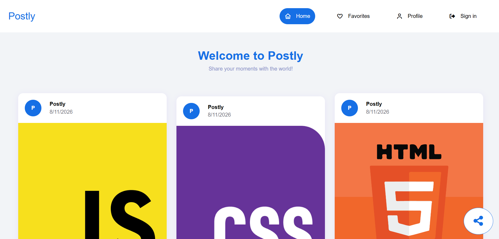
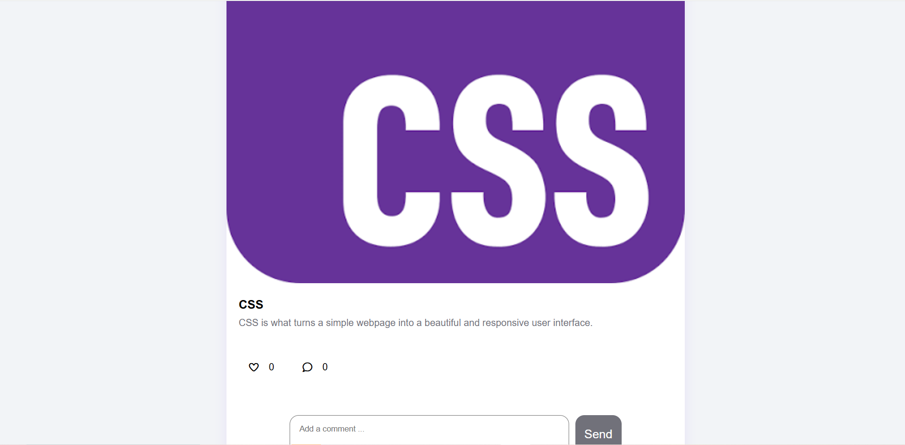

# Postly

A lightweight, client-side-only social sharing app for sharing moments. Users can sign up, publish posts, like their favorites, and leave comments — all powered by vanilla JavaScript and persisted in the browser.



## Overview

Postly is a front-end-only platform that lets you share posts with images and text, browse the community feed, like posts, comment on them, and manage your own content from a personal profile. Since everything lives in the browser, there is no backend, no database, and no account to configure — just open it and start sharing.

## Features

- **Authentication** — Sign up, sign in, and sign out with client-side validation
- **Create & manage posts** — Add a title, image URL, and details; edit or delete your own posts with a confirmation dialog
- **Likes** — Heart your favorite posts and review them on a dedicated Favorites page
- **Comments** — Comment on any post and open the post detail view
- **Profile page** — See your info and the number of posts you have created
- **Responsive design** — Mobile hamburger menu and layouts that adapt to any screen size
- **Local persistence** — Data is stored in `localStorage` / `sessionStorage`, so your posts survive page reloads



## Demo Account

A demo account is seeded automatically on first run:

| Field    | Value             |
| -------- | ----------------- |
| Email    | `postly@gmail.com` |
| Password | `postly`          |

You can also create your own account from the **Sign Up** page.

## Tech Stack

- HTML5
- CSS3
- Vanilla JavaScript (ES Modules)
- Font Awesome for icons
- No frameworks, no build tools, no dependencies

## Getting Started

Clone the repository:

```bash
git clone https://github.com/ayaabduljawad750-cyber/Postly.git
cd Postly
```

The app uses ES Modules, so you **must serve it over HTTP** — opening `index.html` directly via `file://` will not work in most browsers. Use any of these:

**Option 1 — Node.js**

```bash
npx serve .
```

**Option 2 — Python**

```bash
python -m http.server 8080
```

**Option 3 — VS Code**

Install the [Live Server](https://marketplace.visualstudio.com/items?itemName=ritwickdey.LiveServer) extension, then right-click `index.html` → **Open with Live Server**.

Then open the printed URL (e.g. `http://localhost:3000` or `http://localhost:8080`) and the app will load.

## Project Structure

```
Postly/
├── index.html           # Home page — community feed
├── signIn.html          # Sign in page
├── signUp.html          # Sign up page
├── addPost.html         # Create a new post
├── post.html            # Single post detail & comments
├── profile.html         # Current user's profile and posts
├── favorites.html       # Liked posts
├── updatePost.html      # Edit an existing post
├── css/
│   ├── gloable.css      # Global reset, focus states, base styles
│   └── all.min.css      # Font Awesome icons
├── js/
│   ├── main.js          # Core data layer — storage, auth, CRUD (localStorage)
│   ├── header.js        # Navigation header (responsive)
│   ├── footer.js        # Footer
│   ├── home.js          # Home feed rendering
│   ├── postCard.js      # Reusable post card component (likes/comments)
│   ├── controlBoxPost.js# Edit/delete controls for own posts
│   ├── dialog.js        # Delete confirmation dialog
│   ├── addPostIcon.js   # Floating "add post" button
│   ├── addPost.js       # Create post form logic
│   ├── updatePost.js    # Edit post form logic
│   ├── post.js          # Post detail page logic
│   ├── profile.js       # Profile page logic
│   ├── favorites.js     # Favorites page logic
│   ├── signIn.js        # Sign in form & validation
│   ├── signUp.js        # Sign up form & validation
│   ├── colors.js        # Shared color constants
│   └── ...
└── webfonts/            # Font Awesome font files
```

## Usage

1. **Create an account** — open the app and go to **Sign Up** (or use the demo account).
2. **Post** — click the floating share button and fill in the title, image URL, and details.
3. **Engage** — like posts from the feed and click the comment icon to open the post and add comments.
4. **Manage** — visit **Profile** to edit or delete your own posts; visit **Favorites** to see everything you have liked.

## Deployment

Since the project is 100% static, hosting is easy.

**GitHub Pages**

1. Push this repository to GitHub.
2. Go to **Settings → Pages**.
3. Under **Build and deployment**, select `Deploy from a branch`, choose `main` / root, and save.

Go to [app.github.com/drop](https://ayaabduljawad750-cyber.github.io/Postly/).

## Roadmap & Limitations

- Authentication is client-side only — data is not secure and passwords are stored in plain text. This is a demo/learning project, not production-ready.
- Data is tied to the browser that created it; clearing storage resets the app.
- Future ideas: real backend + database, image upload instead of URL-only, server-side auth.

